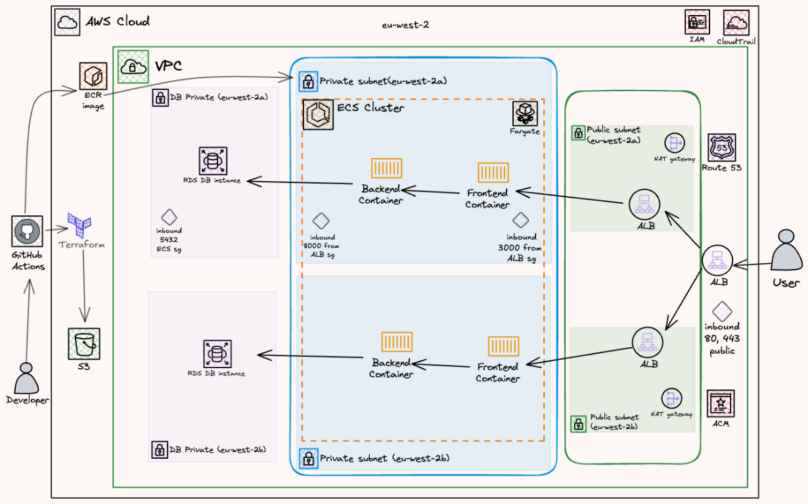
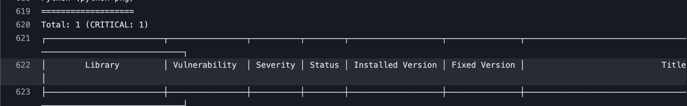

# GymFuel - ECS DevOps Production Project

## Content
- [Overview](#overview)
- [Architecture](#architecture)
- [Tech Stack](#tech-stack)
  - [Application](#application)
  - [DevOps/Infrastructure](#devopsinfrastructure)
- [Architecture Explained](#architecture-explained)
  - [Terraform State Management](#terraform-state-management)
  - [CI/CD Pipelines](#cicd-pipelines)
  - [Security](#security)
  - [Monitoring and Observability](#monitoring-and-observability)
- [Local Development Setup](#local-development-setup)
  - [Prerequisites](#prerequisites)
  - [Using Docker Compose](#using-docker-compose)
  - [Terraform Setup](#terraform-setup)
- [Development Roadmap](#development-roadmap)
- [License](#license)
- [Support](#support)

## Overview
GymFuel is a complete full-stack project that demonstrates modern web application development and production ready DevOps practices. This project showcases a Next.js frontend with a FastAPI backend, featuring AI-powered recipe generation, meal planning, grocery tracking, and a coach-client system. This is deployed on AWS ECS with containerised infrastructure.

## Architecture


### Architecture Explained

1. **CI/CD Pipeline:** GitHub Actions → Terraform → AWS
2. **Container Registry:** Docker → Amazon ECR
3. **Load Balancing:** Application Load Balancer with health checks
4. **Container Orchestration:** ECS Fargate across multiple AZs
5. **Monitoring:** CloudWatch logs and metrics

## Tech Stack

### Application
- **Frontend:** Next.js 16, React 19, TypeScript, Tailwind CSS v4, shadcn/ui
- **Backend:** FastAPI (Python 3.11), PostgreSQL
- **Authentication:** JWT with role-based access (client/coach)
- **AI Integration:** Recipe generation API (coming soon!)

## Infrastructure

### Cloud
- **Containerisation:** Docker multi-stage builds for optimised image sizes
- **Orchestration:** AWS ECS (Elastic Container Service) with Fargate, Production Ready
- **Container Registry:** AWS ECR (Elastic Container Registry)
- **Database:** AWS RDS PostgreSQL with optional automated backups
- **Networking:** AWS VPC with public/private subnets/database subnets, Application Load Balancer, Multi-AZ deployment
- **Infrastructure as Code:** Terraform for cloud infrastructure, Docker Compose for local development
- **Reverse Proxy:** Nginx for request routing (only for docker-compose)

### Security
- **IAM Roles:** IAM Role-based access control for AWS resources, least privilege principle
- **Logging:** AWS CloudTrail for activity logging
- **HTTPS:** Automatically provisioned SSL/TLS certificates using AWS Certificate Manager (ACM)
- **Security Groups:** AWS Security Groups for network traffic control

### Terraform State Management
- **Remote Backend:** S3 bucket in `eu-west-2` with encryption enabled
- **Benefits:** Centralised state storage, team collaboration, automated backups, cross-environment consistency

### CI/CD Pipelines
1. CI Pipeline (ci.yml)
    - **Trigger:** On push to main branch
    - **Actions:**
      - Build Docker image using Dockerfile
      - Scan Images using Trivy
      - Push Docker image to ECR
      - Deploy to ECS Fargate

### Trivy (Security Scanning)


Image is showing Trivy blocking a CRITICAL vulnerability, stopping my workflow from proceeding and preventing deployment.

---

## Setup Guide

### Prerequisites
- Docker
- AWS CLI
- Terraform for [Terraform Setup](#terraform-setup)
- Added access keys to use workflow automation (GitHub Actions)

### Terraform Setup
1. Clone the repository:
    ```bash
    git clone https://github.com/wegoagain-dev/ECS-GymFuel.git
    cd ECS-GymFuel
    ```
2. Configure terraform.tfvars and modify where needed
    ```bash
    cd terraform
    cp terraform.tfvars.example terraform.tfvars
    ```
3. Create a new S3 bucket for Terraform state storage:
    ```bash
    # create bucket (with same name as the backend s3) first in aws with bucket name, region, versioning, encryption, block public access
    ```
4. Initialise Terraform:
    ```bash
    terraform init
    ```
4. Apply Terraform configuration:
    ```bash
    terraform apply
    ```
5. Initialise GitHub Actions:
    ```bash
    cd ..
    git init
    git add .
    git commit -m "Initial commit"
    git branch -M main
    git remote add origin https://github.com/<your-name>/<your-repo-name>.git # create a new repository on GitHub and replace <your-name> with your username
    git push -u origin main
    ```

### Using Docker Compose
1.  **Configure Environment Variables**
    Copy the example configuration file to create your local secrets file:
    ```bash
    cp .env.example .env
    ```
2.  **Start the Application**
    Build and start the containers in the background:
    ```bash
    docker-compose up -d --build
    ```
3.  **Access Services**
    - Web App: http://localhost (http://localhost) (Proxied via Nginx)
    - API Docs: http://localhost:8000/docs (http://localhost:8000/docs) (Swagger UI)
    - Database: localhost:5432 (User/Pass: postgres/postgres from default .env)
4.  **Stop the Application**
    To stop all running containers:
    ```bash
    docker-compose down
    ```

---

## Development Roadmap

- [ ] Full AI Recipe Generation
- [ ] Mobile app (React Native)
- [ ] Implement OIDC instead of manual github actions keys
- [ ] Monitoring and Observability (CPU, Memory, Disk Space)

## License

Copyright (c) 2026 Tawfiq Rahman. All Rights Reserved.
This project is proprietary and may not be copied, modified, or distributed without written permission.

## Support

For support, email tsdevelops00@gmail.com or open an issue in the repository. Dont be shy to contact me!
